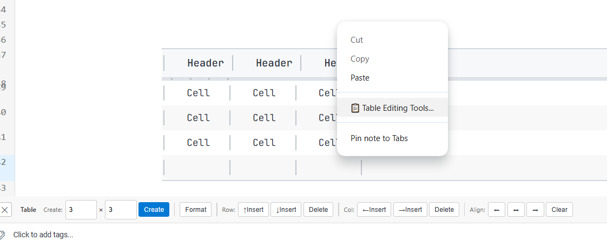
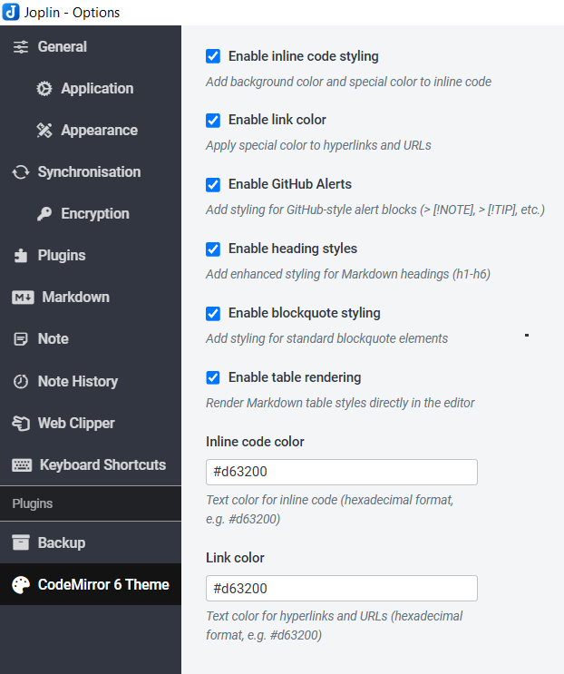
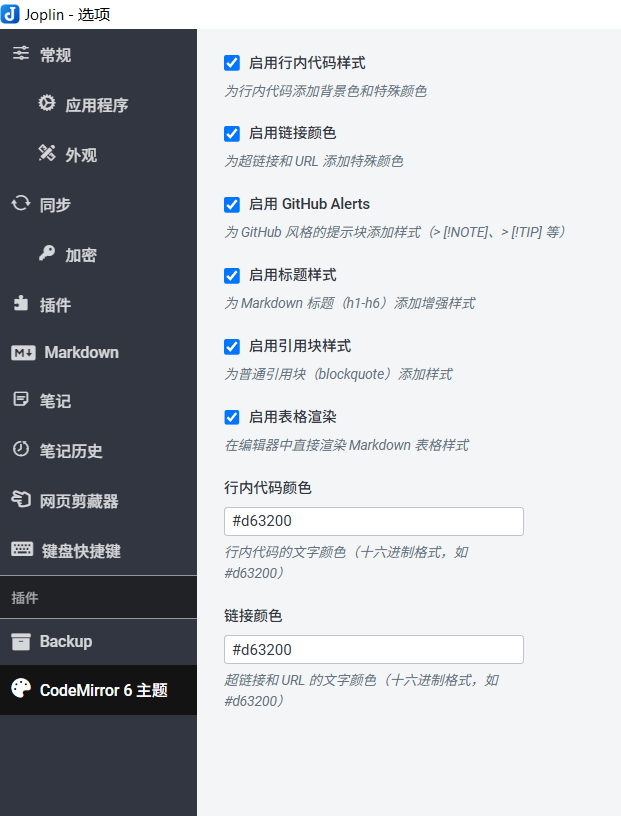

# CodeMirror 6 Theme for Joplin

Enhanced editor styling and productivity features for Joplin notes. Support English and Chinese language.





The experience will be better when used with my [newly released plugin](https://joplinapp.org/plugins/plugin/com.github.full-notebook-view/?search=maintainer%3D%22rinchord%22%20max-results%3D20).

## Features

### Inline Code Styling
Adds background color and custom text color to inline code blocks for better visibility.

### Link Color Customization
Apply custom colors to hyperlinks and URLs throughout your notes.

### GitHub Alerts
Full support for GitHub-style alert syntax in the editor:
- `> [!NOTE]` - Blue info box
- `> [!TIP]` - Green tip box
- `> [!IMPORTANT]` - Purple important box
- `> [!WARNING]` - Orange warning box
- `> [!CAUTION]` - Red caution box

### Enhanced Heading Styles
Improved visual hierarchy for Markdown headings (h1-h6) with custom font sizes, weights, and divider lines.

### Blockquote Styling
Refined appearance for standard blockquote elements.

### Heading Shortcuts
Quick keyboard shortcuts for toggling heading levels:
- `Ctrl+1` through `Ctrl+6` - Toggle H1-H6 headings
- Press once to add heading markers
- Press again on the same level to remove them
- Works on the current line where your cursor is positioned

### Inline Math Shortcuts

Quick keyboard shortcut for adding inline math notation:
- `Ctrl+$` - Toggle `$` symbols around selected text for inline math (LaTeX)
- Select any text and press `Ctrl+$` to wrap it with `$...$`
- Press again to remove the math notation

### Table Editing Tools
Comprehensive table editing features accessible from the editor:
- `Ctrl+Shift+F` - Format table
- `Ctrl+Enter` - Add row below
- `Ctrl+Tab` - Add column right
- Access more table operations from the toolbar (right-click > Table Editing Tools)
- Tools include row/column insertion, deletion, moving, and text alignment

## Configuration

All features can be toggled in Settings → CodeMirror 6 Theme:

**Feature Toggles**
- Enable inline code styling
- Enable link color customization
- Enable GitHub Alerts
- Enable heading styles
- Enable blockquote styling

**Color Customization**
- Inline code color (hex format, default: `#d63200`)
- Link color (hex format, default: `#d63200`)

**Keyboard Shortcuts** (可在设置中自定义)
- Heading shortcuts: `Ctrl+1` through `Ctrl+6`
- Math inline notation: `Ctrl+$` (default)
- Table formatting: `Ctrl+Shift+F`
- Table row insertion: `Ctrl+Enter`
- Table column insertion: `Ctrl+Tab`

## Installation

1. Download the latest `.jpl` file from releases
2. In Joplin, go to Settings → Plugins
3. Click the gear icon and select "Install from file"
4. Choose the downloaded `.jpl` file
5. Restart Joplin

## Quick Start

### Using Heading Shortcuts
1. Position cursor on any line
2. Press `Ctrl+1` to `Ctrl+6` to toggle heading levels
3. Press the same shortcut again to remove the heading

### Using Math Notation
1. Select any text
2. Press `Ctrl+$` to wrap it with `$` symbols
3. Press `Ctrl+$` again to remove the notation

### Using Table Editing Tools
1. Right-click in the editor → "📋 Table Editing Tools..."
2. A toolbar appears at the bottom with table operations
3. Click the ✕ button to close the toolbar
4. Use keyboard shortcuts:
   - `Ctrl+Shift+F` - Format table
   - `Ctrl+Enter` - Add row below
   - `Ctrl+Tab` - Add column right

## Development

Build the plugin:
```bash
npm install
npm run dist
```

The plugin package will be generated in the `publish/` directory.

For more development information, see [GENERATOR_DOC.md](./documents/GENERATOR_DOC.md)


## License

MIT
